## Serverless URL Shortner using AWS

Are you sick of sending long cubersome URL via mails or chats which looks messy. URL shortner is a great way of managing such long URLs and whats more amazing about it that you can make it in-house with a Serverless approach which lowers your cost too of maintaining an application. When it comes to Serverless there is nothing better than AWS Managed Service. Even if you have no prior knowledge of AWS just get an account, read about the services being used and follow though the steps.

### AWS Services to build a Serverless URL application

**AWS DynamoDB :**  Amazon DynamoDB is a key-value and document database that delivers single-digit millisecond performance at any scale. It's a fully managed, multiregion, multimaster, durable database with built-in security, backup and restore, and in-memory caching for internet-scale applications. _In our application we are using it as a persistent store to store the mappings of lorg URLs and their shorter version._

**AWS Lambda :** AWS Lambda lets you run code without provisioning or managing servers. Also better know as Function As A Service(FaaS), you pay only for the compute time you consume. We have two lambda codes written: One for to convert long_url into short_url and push the data to DynamoDB. _Another for retreiving the long_url from the dynamo table everytime a user visits the short_url._

**AWS API Gateway :** Amazon API Gateway is a fully managed service that makes it easy for developers to create, publish, maintain, monitor, and secure APIs at any scale. APIs act as the "front door" for applications to access data, business logic, or functionality from your backend services. _For us, API gateway has 3 methods: GET /admin --> to help us load the index page, POST /create --> to help us convert the long_url to short_url, GET /{short_id}
 --> to redirect the short_url to the long one._
 
**AWS CloudFront :** Amazon CloudFront is a fast content delivery network (CDN) service that securely delivers data, videos, applications, and APIs to customers globally with low latency, high transfer speeds, all within a developer-friendly environment. _For us it allows us to set our origin as the API gateway endpoint and caches the content for us._
 
**AWS IAM :** AWS Identity and Access Management (IAM) enables you to manage access to AWS services and resources securely. _We use to to define Role and Policy for Permissions to call DynamoDB from Lambda._

**AWS Route53 :** Amazon Route 53 is a highly available and scalable cloud Domain Name System (DNS) web service. _It will act as a DNS service for the a custom domain that you want to associate to your API._

**AWS ACM :** AWS Certificate Manager is a service that lets you easily provision, manage, and deploy public and private Secure Sockets Layer/Transport Layer Security (SSL/TLS) certificates for use with AWS services and your internal connected resources. _If we have a custom domain, ACM will help us get a custom certicate for the application._

### Architectural Diagram and Workflow

When user wants to shorten the URL:

1. _Client will make a request to the custom domain which hits Route53. ACM helps to secure the connection_          
2. _Route53 entry for your domain to resolve to the CNAME value of the target domain name which will be cloudfront distribution(CDN)_  
3. _CDN has the origin setup as API gateway_  
4. _API Gateway send a GET request to /admin and gets a response as the index page where user can enter a URL_      
5. _Once User enters the long URL it sends a POST request to /create method which calls a lamdba function_  
6. _The lambda function shortens the URL and return the short URL. It also makes an entry in the dynamo table_  

When user browses the short URL:

7. _When user enters the Short URL it calls a GET method from the API Gateway to a lamdba function_    
8. _The lamdba function looks up inthe dynamo table and gives back the long URL_ 
9. _API Gateway provides a redirection (HTTP 301 status code) to the long url_   

### DynamoDB

1. Create a Dynamo DB table: `url-shortener-table`
2. Add a Primary Key Value which is String : `short_id`


### IAM Policy

1. Create an IAM Policy with the : `lambda-dynamodb-url-shortener`
2. [Download Policy Details](https://github.com/jeeri2204/Serverless-URL-Shortner/blob/gh-pages/lambda-dynamodb-url-shortener)
3. Make sure u enter the correct details for AWS-REGION(where dynamo table is create), AWS-ACCOUNT and DYNAMO-TABLE(in our case it is `url-shortener-table`)


### IAM Role

1. Select Trusted Entiny as Lambda from the Services
2. Create an IAM Role: `lambda-dynamodb-url-shortener-role`
3. Attach the IAM Policies: `AWSLambdaBasicExecution` and the one created above `lambda-dynamodb-url-shortener`


### Lamdba to create Short URL

1. Create a Lamdba function.  
NAME: `url-shortener-create` \
RUNTIME: `Python 3.6` \ 
ROLE: `lambda-dynamodb-url-shortener-role`\
2. [Add the Code to the Function ](https://github.com/jeeri2204/Serverless-URL-Shortner/blob/gh-pages/url-shortener-create)
Note that I have added comments in the function to understand better. Make sute to set the region and dynamo db table name to approriate value. 
3. Add 3 environment varables to the lamdba function. \
```markdown
APP_URL : CLOUNDFRONT URL or CUSTOM DOMAIN URL to be added later (example : https://d24bkyagqs44nj.cloudfront.net/t/ ) 
MIN_CHAR : 12 
MAX_CHAR : 16 
```

### Lamdba to create Retrieve Long URL

1. Create a Lamdba function    
NAME: `url-shortener-retrieve` \
RUNTIME: `Python 3.6` \
ROLE: `lambda-dynamodb-url-shortener-role` \
2. [Add the code below to the lamdba function ](https://github.com/jeeri2204/Serverless-URL-Shortner/blob/gh-pages/url-shortener-retrieve)
Note that I have added comments in the function to understand better. Make sute to set the region and dynamo db table name to approriate value. 

### Create NEW API

1. Build a new REST API from the API Gateway console: `url-shortener-api`
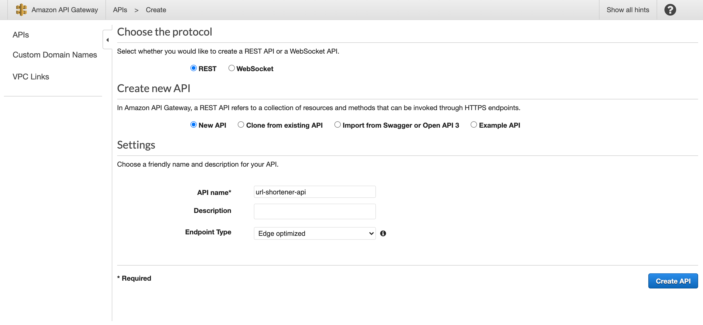

2. Create a new Resource from actions called : `/admin`. This will be location which displays the homepage
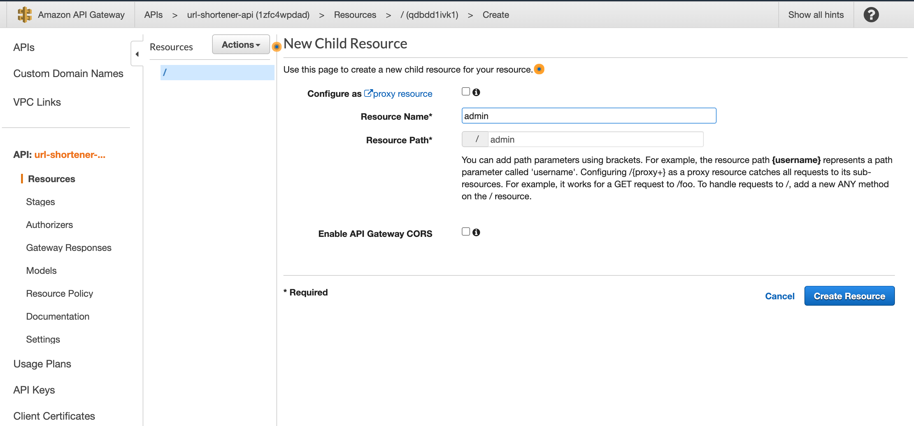

3. Create a `GET` method with integration type as `MOCK`.  Once done it will show you a screen similar to the once below
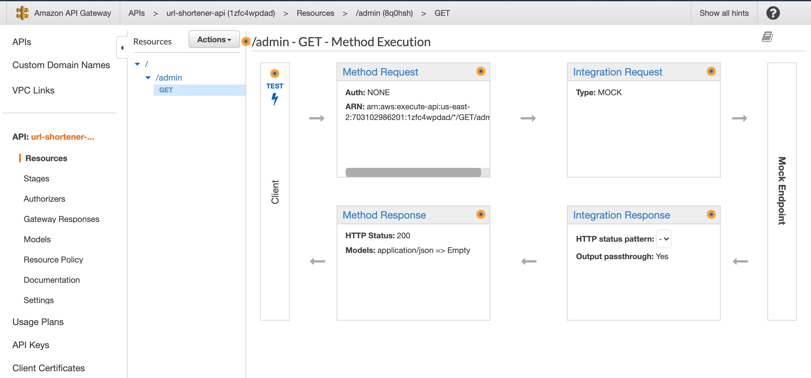

4. Now we will set up the Integration Reponse so that if we enter `http://URL/admin` , it send a get reponse to fetch our homepage. Select the `Intergration Response` under GET method
5. Under `Mapping Templates`,  click `application\json`.
6. Copy paste the [Code present here](https://github.com/jeeri2204/Serverless-URL-Shortner/blob/gh-pages/adminfile) just like on the image shown below.
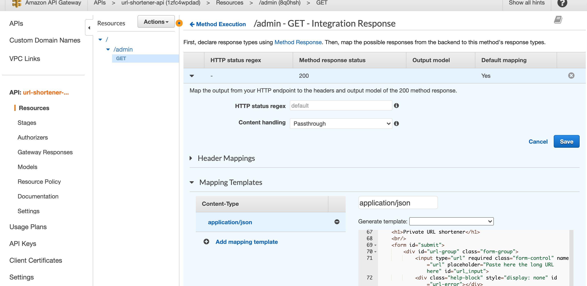

7. Select the root resource `/` resource and then create another resource called `\create`. 
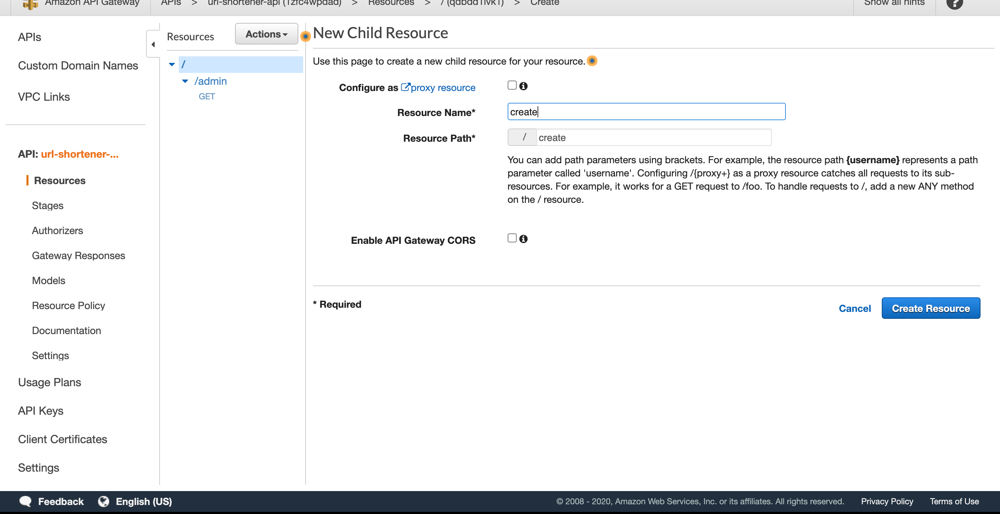

8.Create a `POST` method,  select `Integration Type` as Lamdba function `url-shortener-create` which was used to convert long url to short.
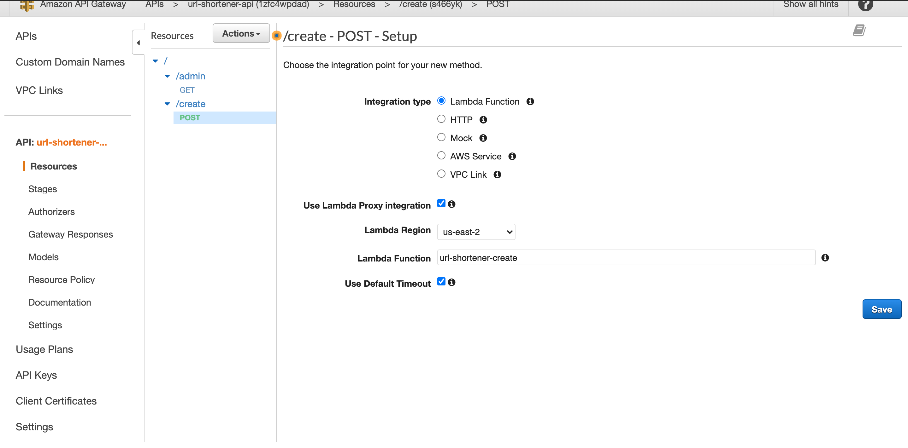

***When we enter the long URL on the home page(http://URL/admin) and select the Button to shorten it,  it send a POST request to the resouce \create via API Gateway to trigger the lamdba function. Once done it will look something like the image below***
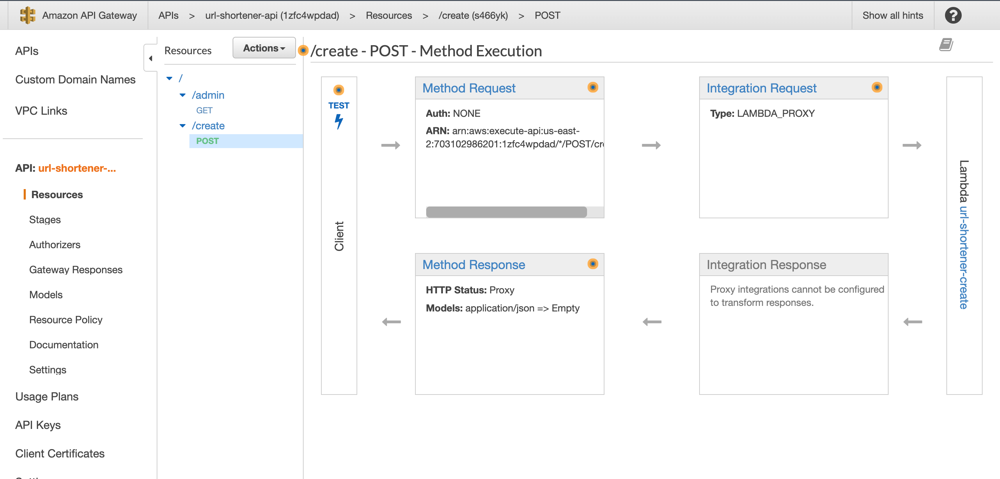

10. Select the root resource `/` resource and then create another resource called `\t`. We do this do that any short url which is created will be of format http://URL/t/shortid
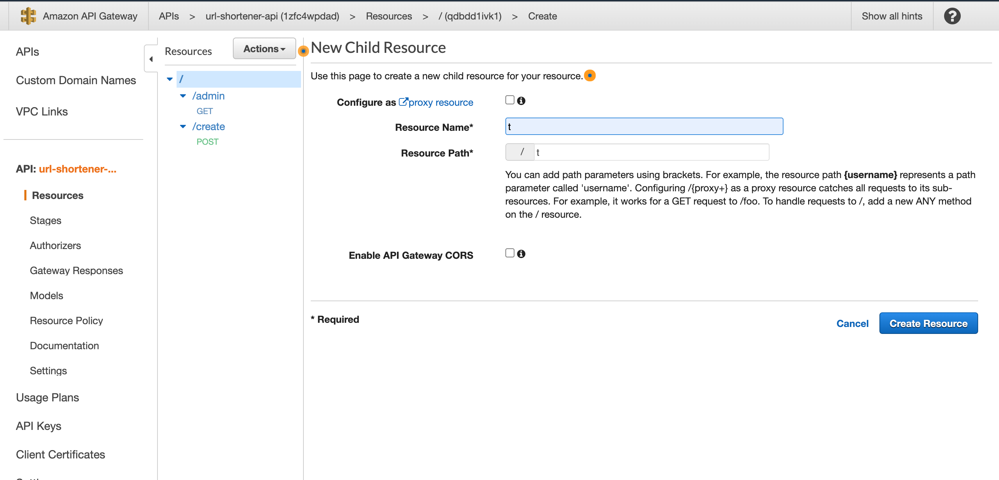

11. Select `/t` and create another resource `/shortid` with `Resource Path` as `{shortid}`.
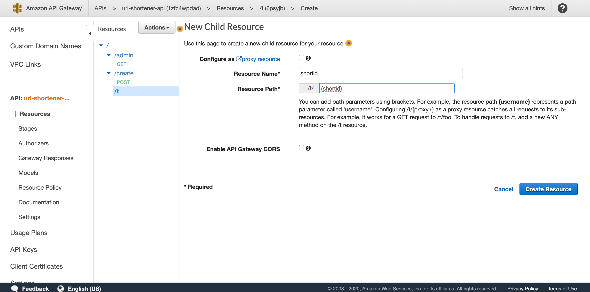

12. Create a `/GET` method under it. Select the lambda as `url-shortener-retrieve` which is used to return long url when we browse short url
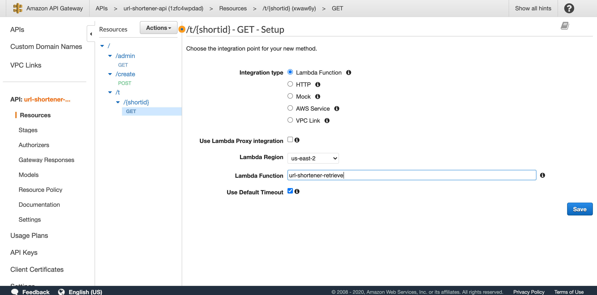

13. Go to the `Integration Request` under the above created GET method 
14. Under `Mapping Templates`, add ContentType as `application/json` and add the below json
```markdown
{
    "short_id": "$input.params('shortid')"
}
```
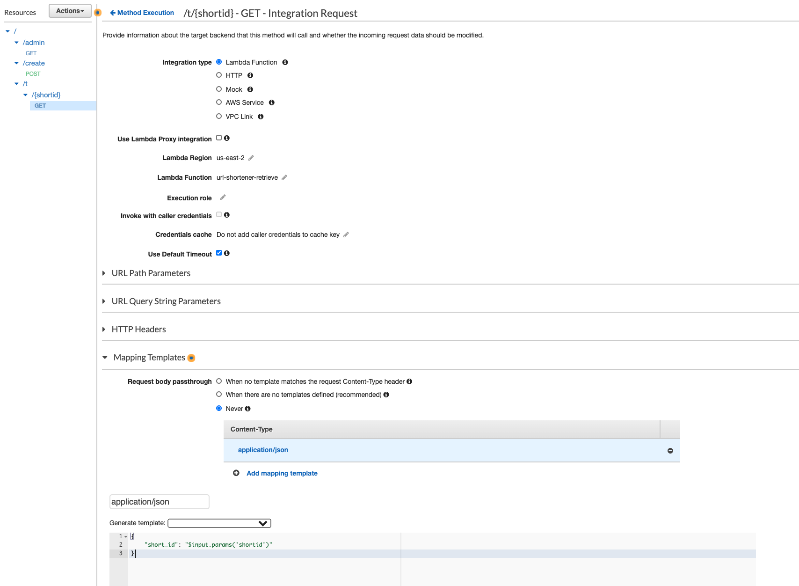

15. Under `Method Response` for GET, delete the 200 HTTP status code and add a 301 status code which will be used for redirection.
16. Add `Location` as the Responce header
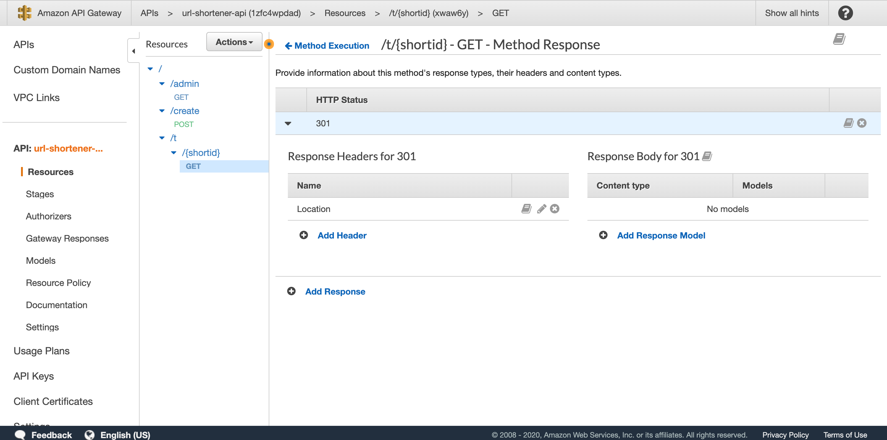

17. Under `Integration Response` for the GET, delete the 200 Status Code and add `301`.  Add Response hearder `Location` value as `integration.response.body.location`. This extracts the value from the lamdba function
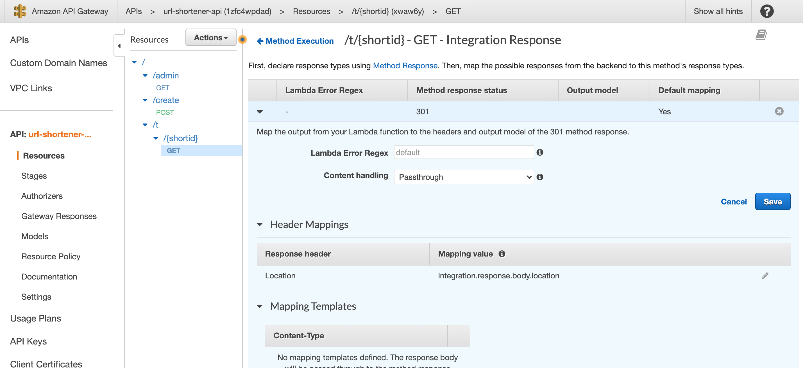

***What this does is when we provide the short url (whcih is in format https://URL/t/xxxxx) it triggers the lamdba function `url-shortener-retrieve`. This function returns `{"statusCode": 301,"location": long_url}`.  The Intergration Response takes the short url which we provide and redirects it to the long_url***

19. Once done, Select the `Deploy API` option from action, provide the stage name such as test and click Deploy. You will be provided with the endpoint followed by the stage name.
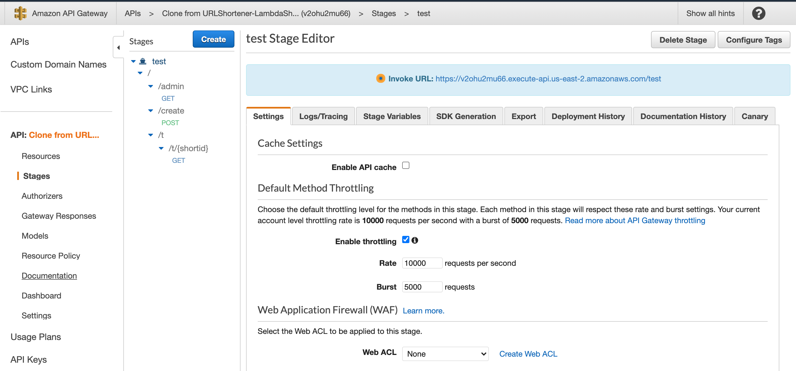

### Create a CloudFront Distribution

***Lets quickly create a cloudfront distribution which can server as an endpoint and caching service for your application***
1. Enter the Origin Domain as the  API gateway endpoint excluding th path(for example: in my case it is https://v2ohu2mu66.execute-api.us-east-2.amazonaws.com)
2. Enter your Origin path. This basically will be the stage name when you deployed the API (for example: in my case it is /test)
3. Under the cache behavior settings, add `Viewer Protocol Policy` as `Redirect HTTP to HTTPS`
4. Put `Allowed HTTP Methods` as `GET, HEAD, OPTIONS, PUT, POST, PATCH, DELETE`
5. Then create the distribution.
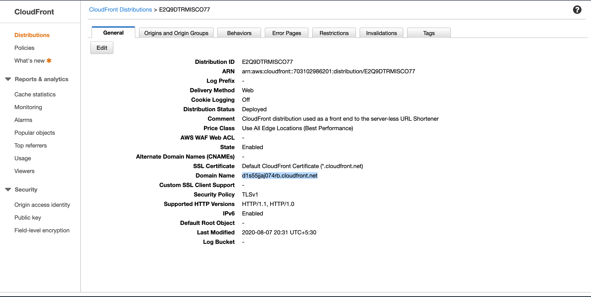

6. Add the CDN endpoint +`/t` in the lamdba function environment variable APP_URL `url-shortener-create`


### Test the Application

***Lets perform a quick test of the endpoints via curl***

```markdown
jdeka$ curl -XGET https://v2ohu2mu66.execute-api.us-east-2.amazonaws.com/test/admin
<!DOCTYPE html>
<html lang="en">
<head>
    <meta charset="utf-8">
    <title>Private URL shortener</title>
    <link rel="stylesheet" href="https://maxcdn.bootstrapcdn.com/bootstrap/3.0.3/css/bootstrap.min.css">
    <script src="https://ajax.googleapis.com/ajax/libs/jquery/2.1.4/jquery.min.js"></script>
    <script type="text/javascript">

    $(document).ready(function() {

        // used only to allow local serving of files
        $.ajaxSetup({
            beforeSend: function(xhr) {
                if (xhr.overrideMimeType) {
                    xhr.overrideMimeType("application/json");
                }
            }
        });
........
```
```markdown
jdeka$ curl -XPOST -H "Content-Type: application/json" https://v2ohu2mu66.execute-api.us-east-2.amazonaws.com/test/create -d '{"long_url": "https://www.google.com/search?q=helloworld"}' 
{"short_id":"https://d24bkyagqs44nj.cloudfront.net/t/3FDeB9ZmjC85","long_url":"https://www.google.com/search?q=helloworld"}
```
```markdown
jdeka$ curl -XGET https://d24bkyagqs44nj.cloudfront.net/t/3FDeB9ZmjC85
{"statusCode": 301, "location": "https://www.google.com/search?q=helloworld"}
```

***Let check the application out***
CDN endpoint + `/admin` gives us the home page


Response back as the short URl
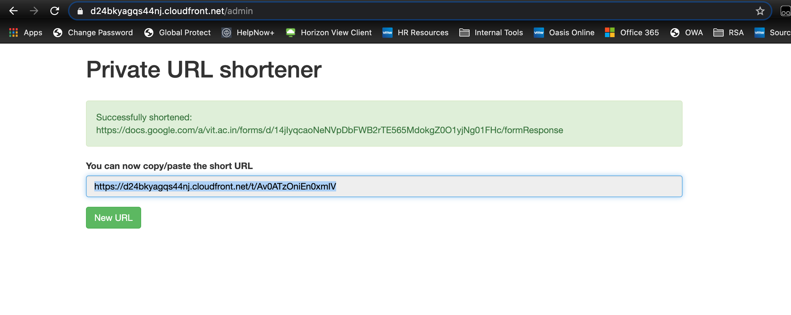


### Sources 
[1] https://aws.amazon.com/dynamodb \
[2] https://aws.amazon.com/lambda \
[3] https://aws.amazon.com/api-gateway \
[4] https://aws.amazon.com/api-gateway \
[5] https://aws.amazon.com/iam \
[6] https://aws.amazon.com/route53 \
[7] https://aws.amazon.com/cloudfront \
[8] https://aws.amazon.com/certificate-manager 
[9] https://aws.amazon.com/blogs/compute/build-a-serverless-private-url-shortener \
[10] https://blog.ruanbekker.com/blog/2018/11/30/how-to-setup-a-serverless-url-shortener-with-api-gateway-lambda-and-dynamodb-on-aws 
