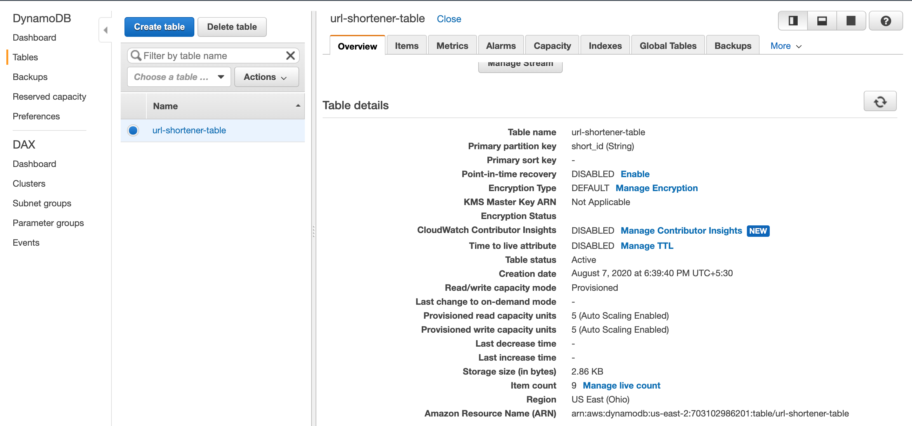

## Serverless URL Shortner using AWS

Are you sick of sending long cubersome URL via mails or chats which looks messy. URL shortner is a great way of managing such long URLs and whats more amazing about it that you can make it in-house with a Serverless approach which lowers your cost too of maintaining an application. When it comes to Serverless there is nothing better than AWS Managed Service. Even if you have no prior knowledge of AWS just get an account, read about the services being used and follow though the steps.

### AWS Services to build a Serverless URL application

**AWS DynamoDB :**  Amazon DynamoDB is a key-value and document database that delivers single-digit millisecond performance at any scale. It's a fully managed, multiregion, multimaster, durable database with built-in security, backup and restore, and in-memory caching for internet-scale applications. _In our application we are using it as a persistent store to store the mappings of lorg URLs and their shorter version._

**AWS Lambda :** AWS Lambda lets you run code without provisioning or managing servers. Also better know as Function As A Service(FaaS), you pay only for the compute time you consume. We have two lambda codes written: One for to convert long_url into short_url and push the data to DynamoDB. _Another for retreiving the long_url from the dynamo table everytime a user visits the short_url._

**AWS API Gateway :** Amazon API Gateway is a fully managed service that makes it easy for developers to create, publish, maintain, monitor, and secure APIs at any scale. APIs act as the "front door" for applications to access data, business logic, or functionality from your backend services. _For us, API gateway has 3 methods: GET /admin --> to help us load the index page, POST /create --> to help us convert the long_url to short_url, GET /{short_id}
 --> to redirect the short_url to the long one._
 
**AWS CloudFront :** Amazon CloudFront is a fast content delivery network (CDN) service that securely delivers data, videos, applications, and APIs to customers globally with low latency, high transfer speeds, all within a developer-friendly environment. _For us it allows us to set our origin as the API gateway endpoint and caches the content for us._
 
**AWS IAM :** AWS Identity and Access Management (IAM) enables you to manage access to AWS services and resources securely. _We use to to define Role and Policy for Permissions to call DynamoDB from Lambda._

**AWS Route53 :** Amazon Route 53 is a highly available and scalable cloud Domain Name System (DNS) web service. _It will act as a DNS service for the a custom domain that you want to associate to your API._

**AWS ACM :** AWS Certificate Manager is a service that lets you easily provision, manage, and deploy public and private Secure Sockets Layer/Transport Layer Security (SSL/TLS) certificates for use with AWS services and your internal connected resources. _If we have a custom domain, ACM will help us get a custom certicate for the application._

### Architectural Diagram and Workflow

When user wants to shorten the URL:

1. _Client will make a request to the custom domain which hits Route53. ACM helps to secure the connection_          
2. _Route53 entry for your domain to resolve to the CNAME value of the target domain name which will be cloudfront distribution(CDN)_  
3. _CDN has the origin setup as API gateway_  
4. _API Gateway send a GET request to /admin and gets a response as the index page where user can enter a URL_      
5. _Once User enters the long URL it sends a POST request to /create method which calls a lamdba function_  
6. _The lambda function shortens the URL and return the short URL. It also makes an entry in the dynamo table_  

When user browses the short URL:

7. _When user enters the Short URL it calls a GET method from the API Gateway to a lamdba function_    
8. _The lamdba function looks up inthe dynamo table and gives back the long URL_ 
9. _API Gateway provides a redirection (HTTP 301 status code) to the long url_   

### DynamoDB

1. Create a Dynamo DB table: 
```url-shortener-table```
2. Add a Primary Key Value which is String : 
```short_id```



### Markdown

Markdown is a lightweight and easy-to-use syntax for styling your writing. It includes conventions for

```markdown
Syntax highlighted code block

# Header 1
## Header 2
### Header 3

- Bulleted
- List

1. Numbered
2. List

**Bold** and _Italic_ and `Code` text

[Link](url) and 
```

For more details see [GitHub Flavored Markdown](https://guides.github.com/features/mastering-markdown/).

### Jekyll Themes

Your Pages site will use the layout and styles from the Jekyll theme you have selected in your [repository settings](https://github.com/jeeri2204/AWS_URL_Shortner/settings). The name of this theme is saved in the Jekyll `_config.yml` configuration file.

### Sources 
[1] https://aws.amazon.com/dynamodb \
[2] https://aws.amazon.com/lambda \
[3] https://aws.amazon.com/api-gateway \
[4] https://aws.amazon.com/api-gateway \
[5] https://aws.amazon.com/iam \
[6] https://aws.amazon.com/route53 \
[7] https://aws.amazon.com/cloudfront \
[8] https://aws.amazon.com/certificate-manager \
